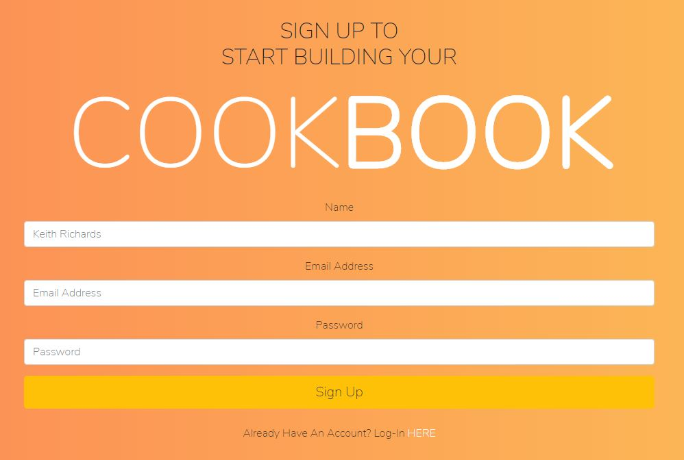

# CookBook

The only recipe app you will ever need!

  Description:
  Our website lets you create a personalized user profile to find new recipes and save them to your favorites for easier access
  
  * Table of Contents:
      * [Installation](#installation)
      * [Usage](#usage)
      * [License](#license)
      * [Contributing](#contributing)
      * [Technologies](#technologies)
      * [Finished_Product](#finishedproduct)
      * [Questions](#questions)

  ## Installation: 

  Required Node Modules:
  
    axios 
    bcryptjs
    express
    express-handlebars
    express-session
    mysql2
    passport
    passport-local
    sequelize

  This app is deployed through Heroku and can be accessed through this link: 
  https://still-sierra-23537.herokuapp.com/  

  Github:
  https://github.com/mandisareed/project-2.git
  ## Usage:
  GIVEN a login page for the recipe finder app

  The user  will be prompted for their email and password. 

  IF the user’s account exists then they will be able to access the landing page

  IF not then they will be shown an error and prompted to create an account

  WHEN the landing page is displayed 

  THEN the user can access previously built meals if they exist.

  WHEN the user starts a search 

  THEN the user is presented with a list of recipes

  WHEN the user clicks the add button

  THEN the recipe will be added to their saved recipes list

  WHEN the user clicks the view saved recipes button 

  THEN they will see all of their saved recipes

  WHEN the user clicks delete on a recipe item, 

  THEN their selected entry will be deleted

  WHEN the user clicks logout
  
  THEN they will be logged out and taken back to the login page

  ## License: 
  undefined
  ## Contributing:
  https://github.com/mandisareed

  https://github.com/tlam1288

  https://github.com/lindyem

  https://github.com/robertluttig
  ## Technologies:
  HTML + CSS + Javascript + Bootstrap +Sequelize + Passport + Handlebars + Express

  API used: Edamam
  ## Finished_Product:
  Sign up page Screenshot
  
  ## Questions:

  Please reach out to either one of us for additional questions:

  robert.luttig@gmail.com

  mandisa.reed@gmail.com

  tlam1288@gmail.com

  lindy.merwin@gmail.com
  

